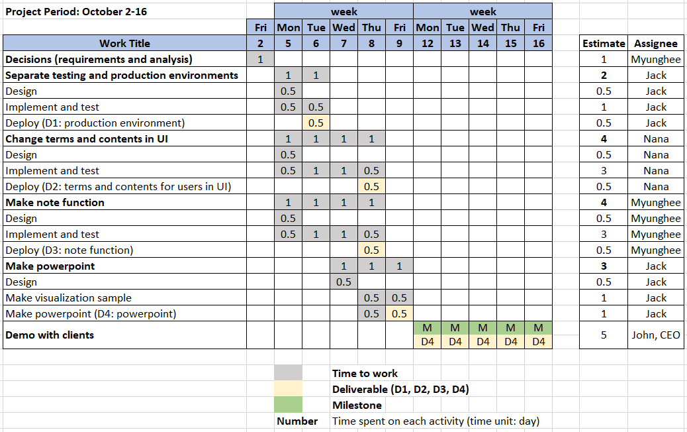

# Project Summary
MyWonder is a new flatform to quickly perform analyzing big data and visualizing it. Without MyWonder, the analysis and visualization take hours. MyWonder can reduce the execution time considerably by distributing massive files on the cloud. MyWonder performs the analysis and visualization under 10 minutes, and provides user-friendly user interface (UI) so that users can use MyWonder very easily on their phones.

# Wastes
1. Waiting: Clients were waiting during the meetings because the CEO called the customer assistance team constantly. It is due to unproper terminology and contents in the user interface which both of the CEO and the clients don’t understand.  
2. Over-processing: The customer assistance team’s work had unnecessary and inefficient steps, talking to designer and meeting developers for the CEO’s questions.   
3. Defects: MyWonder had some defaults, improper terms and contents in UI, no note function, not separate testing and production environments.

# Deliverables 
1. D1: Seperate production environment from testing environment
2. D2: User-friendly terms and contents in UI
3. D3: Note function
4. D4: Powerpoint with screenshots of visualization exmaples

# Milestone
Successful demos of MyWonder with clients

# Gantt Chart

    

